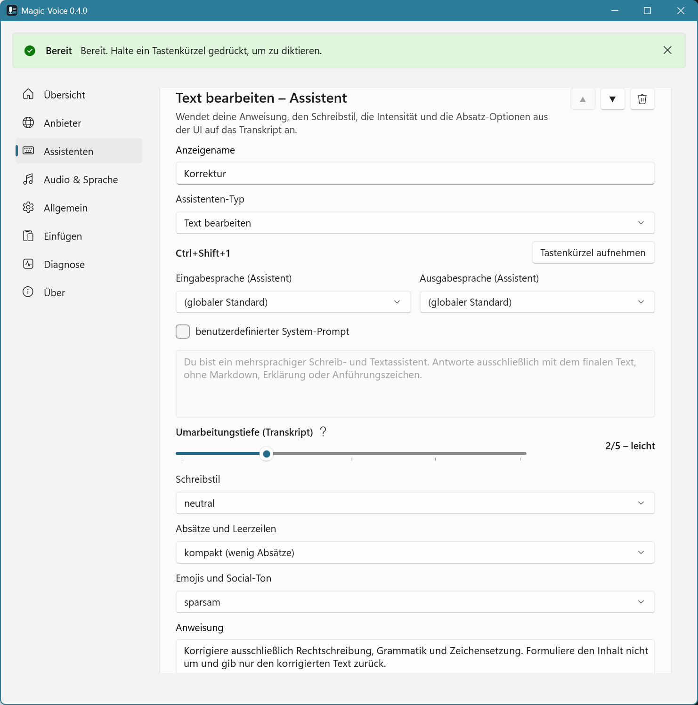

# Magic-Voice

Magic-Voice ist eine Windows-Desktop-App für gesprochene Eingabe bei gedrückter Taste (Push-to-Talk). Audio wird lokal aufgenommen, in der Cloud transkribiert, per KI verarbeitet und anschließend in das aktuell aktive Eingabefeld eingefügt. Du legst dir beliebig viele Assistenten an, jeder mit eigenem Typ, Tastenkürzel, Anweisung, Intensität und Schreibstil.

**Hinweis:** Die App und der zugehörige Quellcode wurden wesentlich mit KI-gestützter Entwicklung (z. B. Assistent in der IDE) erstellt und von Menschen geprüft und freigegeben.



## Voraussetzungen

- Windows 10/11 x64
- .NET SDK 10.0.202 oder neuer
- Visual Studio mit .NET Desktop Development und Windows App SDK-Unterstützung
- Mikrofonzugriff in den Windows-Datenschutzeinstellungen
- API-Schlüssel für einen bekannten Anbieter von Transkription und KI

## Start in Visual Studio

1. `Magic.sln` öffnen.
2. `MagicVoice` als Startprojekt wählen.
3. Konfiguration `Debug|x64` verwenden.
4. NuGet-Restore abwarten und mit F5 starten.

Beim ersten Start werden `%LOCALAPPDATA%\Magic-Voice\settings.json` und `%LOCALAPPDATA%\Magic-Voice\logs` erzeugt sowie die fünf Standard-Assistenten angelegt. Es gibt keinen First-Run-Assistenten. Fehlen Pflichtwerte, öffnet die App das Einstellungsfenster mit dem Status `Einrichtung erforderlich`.

Die Bereiche `Transkription` und `KI` enthalten jeweils Anbieter, Modell und API-Schlüssel. Die App kennt die Endpunkte der unterstützten Anbieter intern; normale Nutzer müssen keine URLs eintragen.

## Assistenten und Typen

Magic-Voice kennt fünf Assistenten-Typen. Du kannst beliebig viele Assistenten pro Typ anlegen — etwa zwei „Korrektur"-Assistenten mit unterschiedlicher Strenge oder mehrere „Bearbeiten"-Vorlagen für verschiedene Aufgaben.

| Typ | Sprachinput wird verstanden als | Quelle |
|---|---|---|
| Korrektur | gesprochener Text, der korrigiert werden soll | nur Sprache |
| Inhalt | gesprochener Text, der professionell formuliert werden soll | nur Sprache |
| Social Media | gesprochener Text, optimiert für Social-Media-Beiträge | nur Sprache |
| Generieren | Anweisung, die KI erzeugt einen neuen Text | nur Sprache |
| Bearbeiten | Anweisung, die KI bearbeitet/antwortet auf den Zwischenablage-Text | Sprache + Clipboard |

Standard-Tastenkürzel beim ersten Start: `Ctrl+Shift+1` … `Ctrl+Shift+5`. Du kannst sie pro Assistent frei vergeben.

## Bedienung

Magic-Voice läuft primär im Infobereich. Das Tray-Menü enthält `Aktiv` und `Beenden`. Ist `Aktiv` nicht angehakt, starten keine neuen Aufnahmen bei gedrückter Taste.

Tastenkürzel gedrückt halten, sprechen, loslassen. Die App stoppt die Aufnahme, transkribiert, verarbeitet und fügt den Text standardmäßig per direkter Eingabe ein. Die Zwischenablage ist als alternative Einfügemethode verfügbar. Beim Typ „Bearbeiten" wird der Zwischenablage-Inhalt zum Zeitpunkt des Hotkey-Drucks als Quelltext mitgegeben — ist die Zwischenablage leer, startet keine Aufnahme.

Im Bereich `Assistenten` der Einstellungen siehst du alle angelegten Assistenten. Pro Assistent kannst du Name, Typ-Anzeige, Tastenkürzel, Intensität, Schreibstil und Anweisung anpassen. Über `+ Assistent hinzufügen` legst du neue Einträge mit dem gewünschten Typ an, mit `Löschen` wieder entfernen (mindestens einer muss bestehen bleiben).

## Datenschutz

Standardmäßig werden keine Audiodaten, Transkripte oder finalen Texte protokolliert. Protokolle enthalten technische Statusinformationen und Fehlerhinweise. API-Schlüssel werden unter Windows per DPAPI für den aktuellen Benutzer verschlüsselt.

Audio wird zur Transkription an den konfigurierten Cloud-Anbieter gesendet. Transkripte werden zur KI-Verarbeitung an den konfigurierten KI-Anbieter gesendet. Beim Typ „Bearbeiten" wird zusätzlich der Inhalt der Zwischenablage zum Zeitpunkt des Hotkey-Drucks an den KI-Anbieter gesendet.

## Build und Tests

```powershell
dotnet restore
dotnet build .\Magic.sln -c Debug
dotnet test .\Magic.sln -c Debug
.\Build.ps1
```

## Installer

**Build und Install sind getrennt:** `.\Build.ps1` legt alles Verteilbare unter **`artifacts\release\Magic-Voice`** ab (diesen Ordner komplett kopieren). `.\Install.ps1` installiert nur (kopiert nach `%LOCALAPPDATA%\Programs\Magic-Voice`, Startmenü; optional `-DesktopShortcut`, `-EnableAutostart`). Auf einem anderen Rechner zuerst den Ordner kopieren, dann z. B. `.\Install.ps1 -SourceDir "D:\Deploy\Magic-Voice"`. `-SkipPrerequisites` überspringt die automatische Runtime-Installation. **`.\Uninstall.ps1`**: deinstallieren; `-RemoveUserData` entfernt zusätzlich `%LOCALAPPDATA%\Magic-Voice` (Settings + Logs).

```powershell
.\Build.ps1
.\Install.ps1
.\Uninstall.ps1
```

**Voraussetzungen (Standard, Install.ps1):** Fehlen **Windows App Runtime 1.8 (x64)** oder **.NET 10 Windows Desktop Runtime**, versucht das Skript deren Installation per **winget**; ohne winget wird die Desktop-Runtime per Microsoft-CDN (Parameter `-DotNetDesktopRuntimeVersion`, Standard **10.0.7**) nachgeladen, die Windows App Runtime per direktem Download. Die Runtime-Installer können **UAC** anzeigen.

## Bekannte Einschränkungen

- Die erste Provider-Implementierung nutzt intern bekannte OpenAI-kompatible HTTP-Endpunkte. Nutzer wählen Anbieter und Modell, tragen aber keine URLs ein.
- Ein echter STT-Rundlauf muss manuell mit Mikrofon und API-Schlüssel geprüft werden.
- Direkte Eingabe per `SendInput` ist der primäre Einfügeweg. Die Zwischenablage ist als Alternative vorhanden, wenn direkte Eingabe in einer Zielanwendung nicht zuverlässig funktioniert.
- Einfügen in erhöhte Zielanwendungen kann scheitern, wenn Magic-Voice nicht mit denselben Rechten läuft.
- Die App erzeugt statische Tray-Icons lokal im Projekt; MSIX-Packaging und Signierung sind noch nicht umgesetzt.
- Solution-Datei `Magic.sln`, Bibliotheken `MagicVoice.Core` und `MagicVoice.Infrastructure` (intern app-agnostisch).
